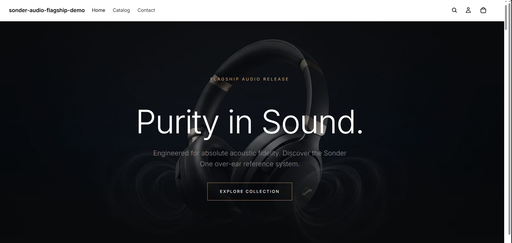
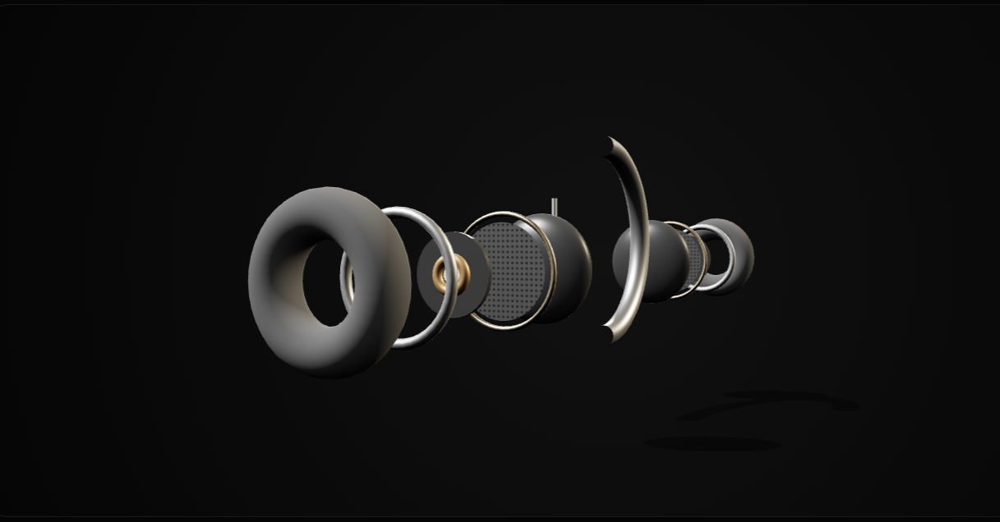
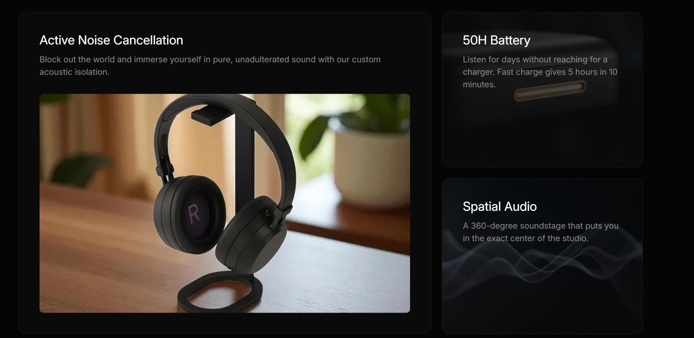
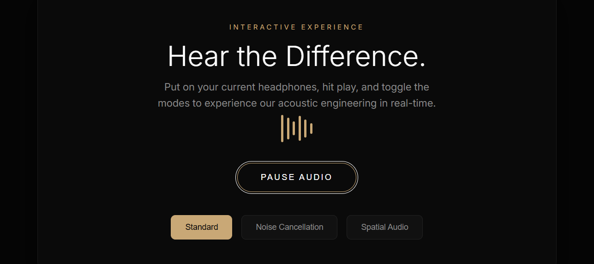
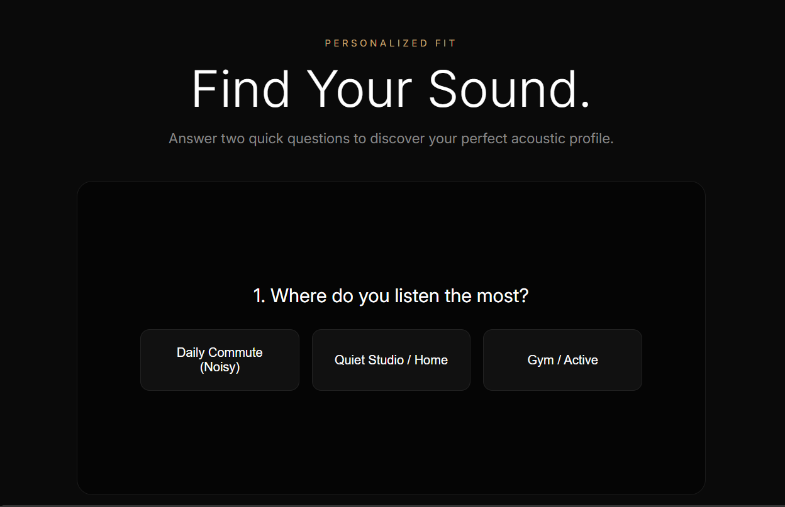
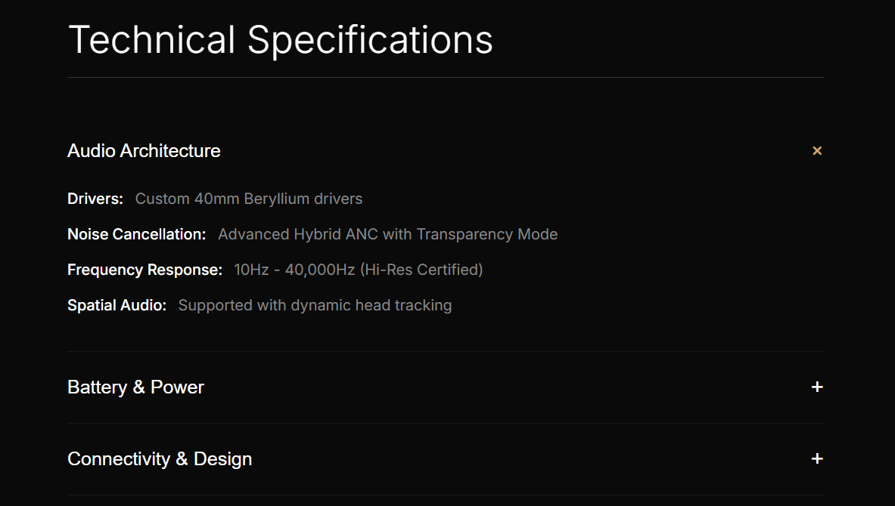

# Sonder Audio — Flagship Shopify Experience[cite: 3]

An Awwwards-caliber, native Shopify Online Store 2.0 flagship product launch experience built to demonstrate high-end creative engineering within Shopify's native ecosystem rather than a headless architecture[cite: 3].

## Project Overview
**Sonder Audio** is a conceptual luxury wireless audio brand designed to rival Apple and Bang & Olufsen product launch pages. The project prioritizes cinematic motion design, spatial 3D interaction, and precise typographic restraint while maintaining seamless performance inside Shopify's native theme engine[cite: 3].

## Tech Stack
* **Platform:** Shopify Online Store 2.0 (Native Liquid Theme)[cite: 3]
* **Animation Engine:** GSAP + ScrollTrigger[cite: 3]
* **Smooth Scrolling:** Lenis Scroll[cite: 3]
* **3D Architecture:** Three.js (WebGL with custom physically-based materials, custom multi-layer parallax, and raycast hotspots)[cite: 3]
* **Audio Processing:** Native browser Web Audio API (Real-time biquad filtering and spatial panning simulation)[cite: 3]
* **Styling:** Custom Modular CSS / CSS Grid[cite: 3]

## Key Flagship Features
* **Cinematic Scroll-Driven Hero (5.1):** Pin-scrolled sequence that crossfades messaging and scales products dynamically[cite: 3].
* **Layered 3D Exploded Viewer:** Real-time WebGL rendering breaking down the headphones into 5 distinct spatial layers (outer shell, acoustic frame, driver unit with copper coil, acoustic chamber, and protein-leather cushions)[cite: 3].
* **Interactive Web Audio Sandbox:** Real-time acoustic processing letting users toggle between Standard, Active Noise Cancellation (ANC), and Spatial Audio modes[cite: 3].
* **Bento-Grid Feature Showcase:** Modern asymmetric card layout with custom micro-interactions and hover states[cite: 3].
* **Fit Profiler Configurator:** Multi-step interactive state engine recommending custom finishes based on listening environment[cite: 3].

## Visual Showcase

### Hero Section


### Layered 3D Architecture & Exploded View


### Bento-Grid Flagship Features


### Web Audio Sandbox


### Profile Personalization


### Technical Specifications


## Performance & Mobile Optimization
* **WebGL Degradation:** Gracefully handles mobile hardware limitations with optimized render loops and touch-action controls[cite: 3].
* **Lighthouse Score:** Optimized asset loading and lazy-loaded media achieving high performance benchmarks for animation-heavy storefronts[cite: 3].
* **Motion Accessibility:** Fully respects `prefers-reduced-motion` browser flags[cite: 3].

## Local Development Setup
1. Clone the repository:
   ```bash
   git clone [https://github.com/ZainAbbas-dev/sonder-audio-shopify-flagship-demo.git](https://github.com/ZainAbbas-dev/sonder-audio-shopify-flagship-demo.git)

   
2. Install Shopify CLI if not already installed.
3. Run theme development server:

```bash
shopify theme dev --store sonder-audio-flagship-demo
```

## Contributing

Contributions, issues, and feature requests are welcome! Feel free to check the issues page or submit a pull request.

## License

Distributed under the MIT License. See `LICENSE` for more information.